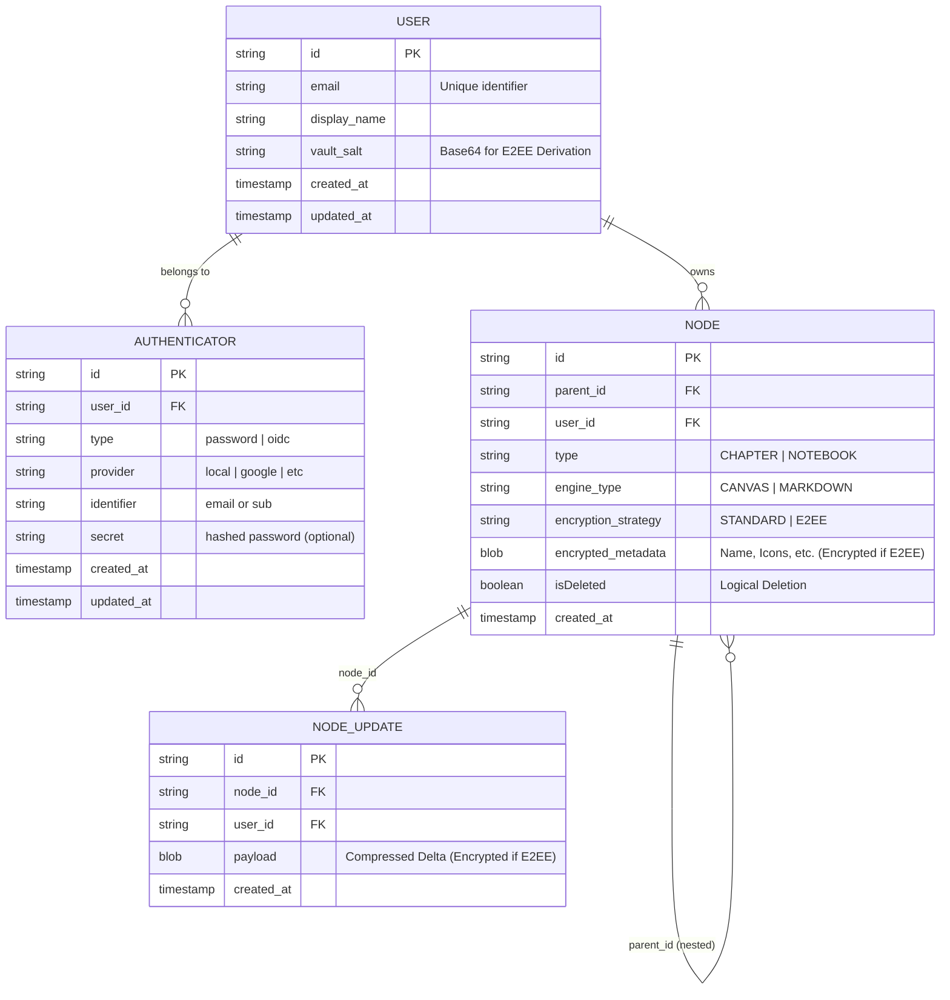

# Data Model Specification (ICONIX Step 4)

| Status | Version | Primary ADRs |
| :--- | :--- | :--- |
| **Draft** | 1.4.0 | ADR-001, ADR-017, ADR-037, ADR-039, ADR-043, ADR-044 |

## 1. Architectural Strategy: E2EE & Local-First

SpatialNotes utilizes a **Local-First End-to-End Encryption (E2EE)** model. Data is encrypted on the client using keys derived from a master password before being persisted to IndexedDB and synchronized to the server.

- **Identity & Auth Model**: A Multi-User system. Core identity (`USER`) is separated from Authentication methods (`AUTHENTICATOR`). This enables future OIDC support.
- **Vault Strategy**: Every user has a `vault_salt` stored on the server to enable cross-device E2EE key derivation.
- **Structural Model (Hierarchy)**: Managed via relational nodes for Folders and Notebooks. Privacy-sensitive data (Names, icons) is stored in an `encrypted_metadata` BLOB. Navigation-critical fields (`parent_id`, `type`, `engine_type`) remain plaintext for server-side tree construction.

- **Node Content Model (Node Updates)**: Binary payloads stored in `node_updates`. These contains serialized Yjs deltas or block data, encrypted only if the `encryption_strategy` is `E2EE`.
- **Metadata Management**: Detailed properties (names, icons) are bundled into `metadata_payload` within `notebook_nodes`.

---

## 2. Entity Relationship Overview (E2EE)

---

## 3. Detailed Component Specifications

### 3.1. User & Authentication (ADR-043, ADR-044)
- **Separation of Concerns**: `USER` represents the logical owner of data. `AUTHENTICATOR` represents how they prove their identity.
- **Vault Salt**: Stored in the `USER` table. It is fetched by the client via email (`GET /api/auth/salt?email=...`) to derive the Master Key.
- **Security**: Data isolation is enforced at the repository level using `user_id`.

### 3.2. Opaque Node Hierarchy
Navigational entities are stored with minimal plaintext metadata.
- **user_id**: Required for all nodes to enforce isolation.
- **Names/Titles**: Encrypted and stored within the initial snapshot of the `ENCRYPTED_UPDATE` stream.

### 3.3. Encrypted Yjs Updates (ADR-039)
Instead of re-encrypting the entire notebook content on every save, we use a stream of binary deltas.
- **user_id**: Added to updates for defense-in-depth verification.
- **Materialization**: The client fetches all deltas for a node, decrypts them in order, and applies them to a local `Y.Doc`.

---

## 4. Persistence Mapping

| Entity | Primary Store | Sync Strategy |
| :--- | :--- | :--- |
| **User & Salt** | SQLite (Server) | Client fetches by email |
| **Authenticators** | SQLite (Server) | Verified during login/register |
| **Node Hierarchy** | SQLite / IndexedDB | Eventual (Scoped by User) |
| **Node Updates** | IndexedDB / API | Real-time (Scoped by User) |

---

## 5. Decision Log (E2EE & Persistence)

1.  **Notebook-level Bundling (Initial)**: Content is grouped by notebook to simplify the crypto boundary.
2.  **Encrypted Yjs Deltas**: Chosen over full-notebook snapshots to meet the **16ms latency budget (ADR-035)**.
3.  **Server-Side Salt**: Stored on the server (ADR-043) to fix cross-device data loss vulnerabilities.
4.  **Multi-User Support**: Promoted to MVP (ADR-044) to ensure scalable architecture and proper data isolation.
