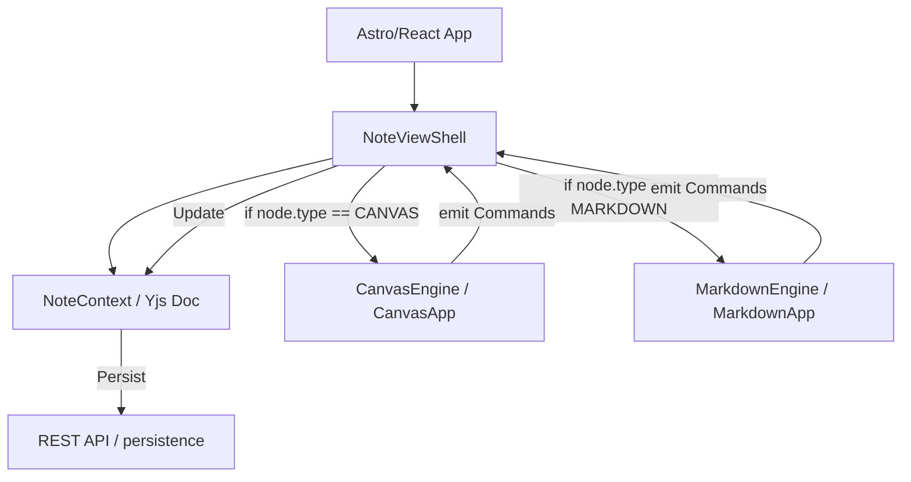

# ADR-030: Single-user Multi-engine Architecture

## Status
4: Accepted

## Context
With the removal of WebSocket synchronization for the MVP, the system now focuses on a robust single-user experience. We need to support diverse note types, starting with "Canvas" and soon adding "Markdown". The current architecture tightly couples the UI shell to the `canvas-engine`, which hinders the addition of new engine types.

## Decision
We will decouple the "Note View Shell" from the specific engine implementations and standardize the communication interface between the UI and the engines.

### 1. Unified Note View Shell
The web application will implement a `NoteViewShell` component responsible for:
- Reading the active node's metadata (type, folder, etc.).
- Selecting and mounting the appropriate Engine (e.g., `CanvasApp` vs. `MarkdownApp`).
- Providing shared cross-cutting concerns (Undo/Redo management, Title editing, Persistence triggers).

### 2. Engine Interface Refinement
Engines will implement the `EngineInterface` from the standalone `engine-core` package, ensuring a perfectly switchable (plug-and-play) architecture. The shell remains agnostic of specific engine implementations.

### 3. Direct Command Bridge
Instead of manually mapping commands in the interaction view, engines should emit commands that match the `core` command structure (`type: CREATE | UPDATE | DELETE`, `payload: NodeRecord | UpdateRequest`). This allows the shell to apply changes directly to the Yjs store without translation logic.

### 4. Local-first Materialization
Since WebSocket sync is removed, the "Materialization" to the backend database will occur via standard REST API calls triggered by local state changes (e.g., when a Yjs transaction completes or at a debounced interval).

## Architecture Diagram

## Consequences

### Positive
- **Extensibility**: Adding a new engine (e.g., Markdown, Spreadsheet) only requires implementing the `EngineInterface` and the UI wrapper.
- **Simplicity**: Reduced boilerplate in `CanvasInteractionView` (now merged into `NoteViewShell`).
- **Consistency**: Centralized header and metadata management.

### Negative
- **Indirection**: The shell adds a layer between the main app and the engine.
- **UI Flexibility**: Specialized engines might need specialized headers that are difficult to unify perfectly.
