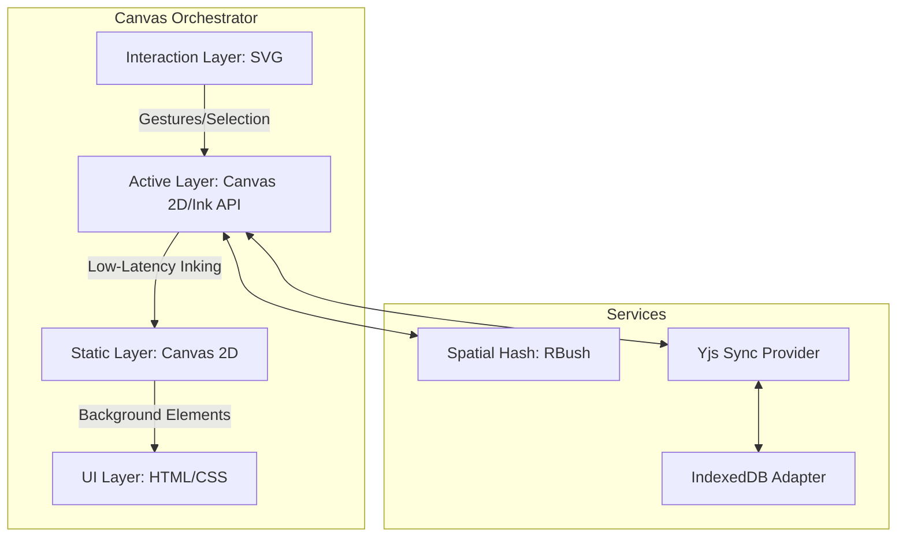

# Design Spec: Modular Custom Ink Engine & Adaptive Gutter

| Status | Date | Version | Primary ADRs | Use Cases |
| :--- | :--- | :--- | :--- | :--- |
| **Draft** | 2026-03-20 | 1.0.0 | ADR-003, ADR-015, ADR-001, ADR-007 | UC1, UC2, UC7 |

## 1. Vision & Strategic Context

Establish a browser-first, handwriting-centric **"Magic Desk"** experience that bridges the gap between digital convenience and physical precision.

- **High Fidelity**: Low-latency inking matching native iPad/Android applications.
- **Reliability (Local-First)**: Eliminate "Sync Anxiety" and data loss by adopting an offline-first architecture (ADR-001).
- **Physical Integrity**: Strict adherence to A4/B5 physical scales (ADR-003) to ensure consistent export and printing quality.

---

## 2. Layered Hybrid Rendering Architecture

The `CanvasEngine` adopts a layered approach to optimize rendering performance while maintaining high interactivity.



### 2.1. Canvas Orchestrator (`CanvasEngine`)
- **Static Layer**: Renders finalized strokes and static background elements (e.g., page lines, grid).
- **Active Layer**: Handles "Live" ink strokes during pointer interaction for maximum responsiveness.
- **Interaction Layer**: An invisible SVG overlay used for gesture detection, selection boxes, and high-level interaction events.

### 2.2. Adaptive Visuals (Dark Mode First)
In alignment with the [UI Design System](../0-requirements/ui-design-system.md), the engine supports:
- **Intelligent Inversion**: Stroke colors (e.g., Black -> White) are dynamically inverted when switching themes.
- **Highlighter Preserving**: Highlighter colors retain their original hue and transparency (`0.3` opacity) to ensure legibility across all backgrounds.

---

## 3. Physical-First Coordinate System (ADR-003)

To ensure "Absolute Size" integrity, the engine treats **Millimeters (mm)** as the single source of truth.

- **Source of Truth**: All coordinates and dimensions are stored in `mm` (e.g., A4 = 210 x 297mm).
- **Calibration**: Assumes standard 96 DPI (1mm ≈ 3.78px) for internal calculations.
- **View Transformation**: A `Matrix3x3` transform handles `Page (mm) <-> Viewport (px)` mapping.
  - Enables resolution-independent **Zoom** (0.1x to 10.0x) and **Pan**.
  - Ensures that a 10mm line on the screen (at 100% zoom) matches 10mm on a physical ruler.

---

## 4. Modular Tool System

Functional isolation is achieved through the **`CanvasTool`** strategy pattern, allowing for easy extensibility of the "Magic Desk" capabilities.

### 4.1. Tool Interface Definition
```typescript
interface CanvasTool {
  id: string;
  onPointerDown(e: PointerEvent, ctx: ToolContext): void;
  onPointerMove(e: PointerEvent, ctx: ToolContext): void;
  onPointerUp(e: PointerEvent, ctx: ToolContext): void;
  renderActive(ctx: CanvasRenderingContext2D): void; // Transient feedback
}
```

### 4.2. Primary Tools Implementation
- **`PenTool`**:
    - **Live Sync (UC1)**: Emits incremental point data to Yjs every 100ms.
    - **Smoothing**: Applies **Catmull-Rom spline** interpolation on `PointerUp` to generate the final `StrokeElement`.
- **`EraserTool` (ADR-015)**:
    - **Stroke Eraser**: Deletes the entire stroke upon intersection (Default).
    - **Precision Eraser**: Splits a stroke into segments at the point of contact, generating new `StrokeElement` records.
    - **Highlighter Filter**: Optional mode to target only `ELEMENT_TAPE` (highlighter) types.
    - **Atomicity (UC7)**: All operations within a single "eraser stroke" are wrapped in a `BatchEraserCommand` for unified Undo/Redo.

---

## 5. Adaptive Guttering & Spatial Layout

Bridging the gap between **Infinite Canvas** and **Physical Page Boundaries** using dynamic rendering logic.

### 5.1. Note Cluster Detection
A "Note Cluster" is a logical group of elements identified by:
- **Spatial Proximity**: Elements within 20mm of each other.
- **Temporal Proximity**: Created within a 10-second window.

### 5.2. Smart Page Breaks (Dynamic Padding)
The engine maintains the illusion of "A4 Pages" without modifying the underlying data:
1. **Gap Search**: From the A4 boundary (297mm), the engine searches **upwards** for a cluster-free gap (minimum 10mm).
2. **Gutter Insertion**: The visual "Page Break" (dotted line) shifts to this gap.
3. **Hard Break**: If no gap is found within the top 50mm, a hard break is enforced at exactly 297mm.
4. **Export Integrity**: Page boundaries are calculated dynamically during rendering and PDF export, ensuring **PageElement coordinates are never permanently altered**.

---

## 6. Persistence, Synchronization & Reliability

### 6.1. Local-First Architecture (ADR-001)
- **Zero Data Loss**: Every stroke is committed to the local browser **IndexedDB** *before* network broadcast.
- **Collision Resolution**: Utilizes Yjs (CRDT) to handle concurrent edits without traditional merge conflicts.

### 6.2. Spatial Optimization (ADR-007)
Each page maintains an incremental **`RBush`** (Spatial Hash) for:
- **O(log N)** intersection lookups for the Eraser.
- High-performance element selection and cluster detection.

### 6.3. Element-to-Node Linking (Future Extensibility)
The data model supports metadata for `target_id`, allowing any element to act as a **Hyperlink** between notebooks or pages—a core request from the digital stationery community.

---

## 7. Implementation Roadmap

### Phase A: Core Engine Foundation
- [ ] Layered Canvas Implementation (2D Context).
- [ ] Millimeter-based Coordinate System & Viewport Transform.
- [ ] Basic `PenTool` with smoothing.

### Phase B: Layout & Intelligence
- [ ] Cluster Detection Logic.
- [ ] Adaptive Guttering (Visual Page Breaks).
- [ ] Virtual Page Strip rendering.

### Phase C: Advanced Interactivity & Sync
- [ ] Batch Eraser System (Stroke & Precision).
- [ ] IndexedDB + Yjs Local-First Persistence.
- [ ] Multi-user Sync (UC1) & Unified Undo/Redo (UC7).
